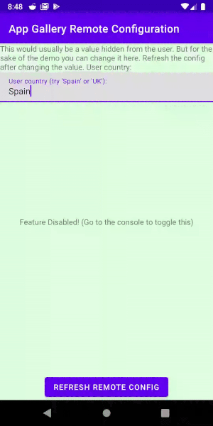

# AppGallery Connect Remote Config

This repository shows you how the Remote Config feature of AppGallery Connect can be used.

The Android App has one main screen with:
 - an input to change the users "country" user attribute.
 - a background color based on remote config
 - a text view based on remote config
 - a button for forcing a refresh of the remote config

When the app loads it loads the latest remote config.
This remote config is used to decide the text on the screen and the background color.
The app uses Huawei Analytics to setup a User Attribute for 'country', and Remote Config to create a conditional remote toggle.
This condition says, when the user is in the UK the screen changes background color and says "Welcome".

We demonstrate the user of Remote Config, Conditions, Analytics, User Attributes and Config Refreshing.

Adding the AppGallery Connect SDK:

https://developer.huawei.com/consumer/en/doc/development/AppGallery-connect-Guides/agc-get-started-android-0000001058210705

Getting started with Remote Config:

https://developer.huawei.com/consumer/en/doc/development/AppGallery-connect-Guides/agc-remoteconfig-android-getstarted-0000001056347165

Huawei Training on Remote Config:

https://developer.huawei.com/consumer/en/training/detail/101601449812686029
